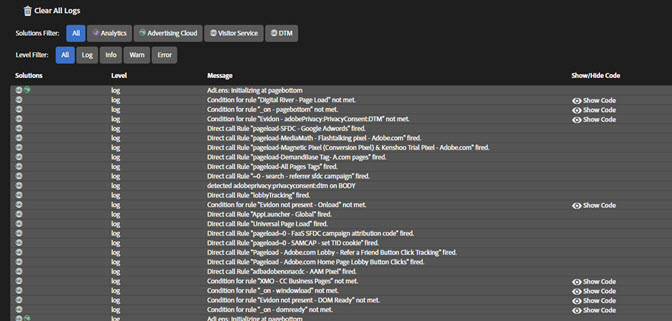

# Registri{#logs}

La schermata Registri fornisce informazioni specifiche per le implementazioni DTM. Per visualizzare queste informazioni non è necessario abilitare lo strumento di debug della console per DTM. Puoi filtrare per soluzioni implementate tramite gli strumenti DTM associati. Puoi scegliere quale dei seguenti livelli di gravità del problema visualizzare sullo schermo:

* Registro
* Info
* Avvisi
* Errori

Alcuni elementi di registro di DTM includono l’opzione Mostra codice nel messaggio. Fai clic su **[!UICONTROL Mostra Codice]** per visualizzare il codice condizionale che determina se attivare o meno una regola.
