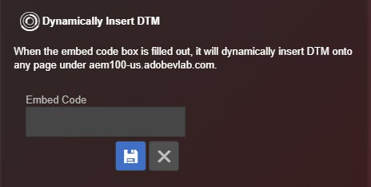

# Strumenti {#tools}

Nella schermata Strumenti, puoi attivare o disattivare vari strumenti per la soluzione installata. Ad esempio, puoi attivare le istruzioni di debug della console di Target o utilizzare la DTM Staging Library. Questi strumenti sono disponibili solo se Target e DTM sono installati sulla pagina.

Puoi inserire dinamicamente  Adobe Experience Platform Launch o DTM su qualsiasi pagina per eseguire il test su una pagina in cui non è installato Platform Launch o DTM. Fai clic sull’icona **[!UICONTROL Embed Code]**, digita il [codice di incorporamento](https://docs.adobe.com/content/help/it-IT/dtm/using/client-side/deployment.html) e fai clic su **[!UICONTROL Save]**.

## Informazioni su DTM {#section-c3d43040440449e5a050170843a600b7}

<table id="table_04625C3319134E169A35DB74C1D1FB31"> 
 <thead> 
  <tr> 
   <th colname="col1" class="entry"> Strumento </th> 
   <th colname="col2" class="entry"> Descrizione </th> 
  </tr>
 </thead>
 <tbody> 
  <tr> 
   <td colname="col1"> 
 Registrazione console DTM 
 </td> 
   <td colname="col2"> 
Questo strumento espone le istruzioni di debug specifiche di DTM alla console del browser. 
 </td> 
  </tr> 
  <tr> 
   <td colname="col1"> 
Uso della libreria Staging 
 </td> 
   <td colname="col2"> 
Questo strumento utilizza la libreria Gestione temporanea per le informazioni di debug DTM. 
 </td> 
  </tr> 
  <tr> 
   <td colname="col1"> 
Disattiva DTM 
 </td> 
   <td colname="col2"> 
Questo strumento blocca il controllo delle informazioni di DTM. 
 </td> 
  </tr> 
  <tr> 
   <td colname="col1"> 
 Inserimento dinamico DTM 
 </td> 
   <td colname="col2"> 
 Questo strumento consente di inserire il codice DTM nella pagina. Utilizza l’editor del codice di incorporamento per modificare il codice inserito. 
 </td> 
  </tr> 
 </tbody> 
</table>

## Informazioni su Target {#section-31090d95f50e455692b672c26e6a2051}

<table id="table_A71D269B49F4417599EBACA44D5CCF4F"> 
 <thead> 
  <tr> 
   <th colname="col1" class="entry"> Strumento </th> 
   <th colname="col2" class="entry"> Descrizione </th> 
  </tr>
 </thead>
 <tbody> 
  <tr> 
   <td colname="col1"> 
Registrazione della console di Target 
 </td> 
   <td colname="col2"> 
Questo strumento mostra le istruzioni di debug specifiche di Target alla console del browser, che iniziano tutte con il prefisso  AT:, mediante l’aggiunta di un cookie denominato  mboxDebug=true al browser. Al momento, le istruzioni della console non vengono visualizzate nella schermata Registri di Debugger, ma sono visibili nella console di debug nativa del browser. 
 
 Questo strumento richiede at.js 0.9.6+. Se utilizzi una versione precedente di at.js, puoi aggiungere all’URL il parametro della stringa di query  ?mboxDebug=true per attivare la registrazione della console. Se utilizzi mbox.js, puoi aggiungere il parametro  ?_AT_Debug=console per attivare la registrazione della console limitata alle attività di Visual Experience Composer (Compositore esperienza visivo). 
 </td> 
  </tr> 
  <tr> 
   <td colname="col1"> 
 Abilita tracce Mbox 
 </td> 
   <td colname="col2"> 
Questo strumento aggiunge informazioni dettagliate alle risposte Target, che possono essere visualizzate nella schermata  Target&gt;Mbox Trace del debugger. 
 
 Devi aver effettuato l’accesso a Experience Cloud in una delle tue schede Chrome per abilitare questo strumento. 
 </td> 
  </tr> 
  <tr> 
   <td colname="col1"> 
Disattiva Target 
 </td> 
   <td colname="col2"> 
Questo strumento disattiva tutte le richieste Target aggiungendo al browser un cookie denominato  mboxDisable=true. 
 
 Questo strumento richiede at.js 0.9.6+. Se utilizzi una versione precedente, puoi aggiungere all’URL il parametro della stringa di query ?mboxDisable=true per disabilitare le mbox. 
 </td> 
  </tr> 
  <tr> 
   <td colname="col1"> 
 Evidenziazione mbox 
 </td> 
   <td colname="col2"> 
 Questo strumento disegna una casella rossa intorno alle mbox precedenti in stile wrapping. 
 </td> 
  </tr> 
 </tbody> 
</table>

Nel video seguente viene illustrato come utilizzare l’estensione Debugger con Adobe Target.

>[!VIDEO](https://video.tv.adobe.com/v/23115t2/)
