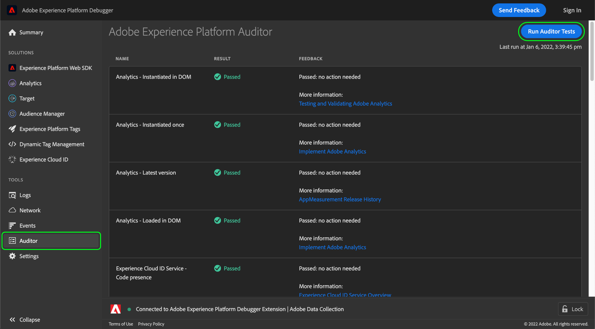

# Scheda Auditor

In Adobe Experience Platform Debugger puoi utilizzare la funzione **[!UICONTROL Auditor]** per eseguire una serie di test di controllo sulla pagina.

Per utilizzare questa funzione:

1. Seleziona **[!UICONTROL Auditor]** nella navigazione a sinistra.
1. Seleziona **[!UICONTROL Run Auditor Tests]**. Una volta completati i test, i relativi risultati vengono visualizzati di seguito.

L’elenco mostra il test e il relativo risultato e fornisce suggerimenti per risolvere eventuali problemi.

## Interpretazione dei risultati delle prove

Ogni test è ponderato e il punteggio del test è uguale al peso assegnato. Se superate un test con un peso di 5, riceverete cinque punti.

| Punteggio | Descrizione |
| --- | --- |
| 0 | Segnala eventuali problemi di cui dovresti essere a conoscenza, ma non influenzarne il punteggio. |
| 1 | consiglia un’ottimizzazione. Nessun impatto sulla precisione dei dati. |
| 2 | Se il test non viene superato, non potrai accedere alle funzioni e alle correzioni più recenti in Adobe Experience Cloud. |
| 3 | test di efficienza e verifica se l’implementazione rispetta le best practice. |
| 4 | in caso di errore, è possibile che si raccolgano dati non affidabili. |
| 5 | in caso di errore, è possibile che si verifichi una perdita di dati. |

Tutti i test superati o non superati. Essi verificano la conformità o la non conformità alle condizioni di prova, pertanto non vi sono punteggi parziali per la conformità parziale. Ad esempio, se il test verifica la versione più recente di una soluzione Adobe e si è in ritardo di una sola versione, si ottiene la stessa valutazione come se si fosse in ritardo di cinque versioni. Le versioni più recenti includono miglioramenti delle prestazioni e correzioni di bug, per cui si consiglia di utilizzare la versione più recente.

È **vivamente consigliato** correggere i risultati di livello 4 o 5.

È **consigliato** correggere i risultati di livello da 1 a 3.

## Tecnologie di Adobe supportate

La funzione di auditor è in grado di valutare le seguenti tecnologie di Adobe:

* Adobe Advertising Cloud DSP
* Adobe Advertising Cloud Search
* Adobe Analytics
* Servizio Adobe Experience Cloud Identity
* Adobe Target
* Tag (precedentemente Adobe Experience Platform Launch)

## Valutazione del test

Per ulteriori informazioni sulle rubriche di test fornite da questa funzione, consulta i seguenti documenti:

* [Coerenza tag](./tag-consistency.md)
* [Presenza tag](./tag-presence.md)
* [Configurazione](./configuration.md)
* [Avvisi](./alerts.md)
