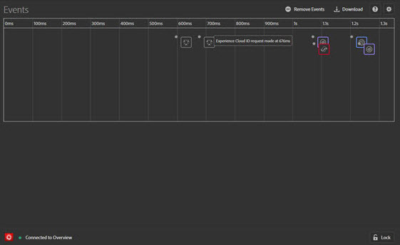

# Eventi {#events}

> [!IMPORTANT]
>
> Adobe Experience Cloud Cloud Debugger 2.0 è attualmente in versione beta. La documentazione e la funzionalità sono soggette a modifiche.

La schermata Eventi mostra una vista grafica degli eventi che si verificano, disposti secondo una sequenza temporale.

Per ogni evento, nella sequenza temporale viene visualizzata un’icona per la soluzione Experience Cloud applicabile. Le icone mostrano anche le modifiche apportate al livello dati (se attivato). Passa il puntatore del mouse sopra un’icona per visualizzare un riepilogo dell’evento. Fai clic sull’evento per ulteriori dettagli. Per visualizzare più eventi, premi MAIUSC+clic o CTRL+clic.

Fai clic su un dettaglio per avere ulteriori informazioni.

## Rileva modifiche apportate al livello dati

Per abilitare il tracciamento delle modifiche al livello dei dati nella sequenza temporale:

1. Fai clic sull’icona a forma di ingranaggio in alto a destra.
1. Inserisci il nome del livello dati.

   

1. Fai clic su **[!UICONTROL Save]**.

I dettagli delle modifiche mostrano tutti gli elementi che sono stati eliminati o aggiunti al livello dati. Puoi fare clic su **{}** per avere più informazioni sul livello dati.

## Scarica le informazioni sull’evento

Fai clic su **[!UICONTROL Download]** per scaricare un file Excel con le informazioni sulle chiamate effettuate da una pagina.